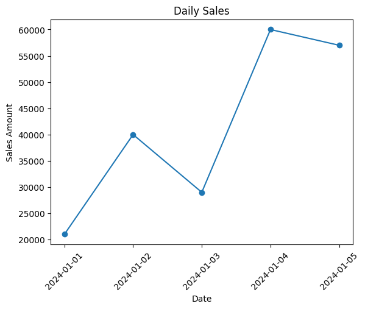
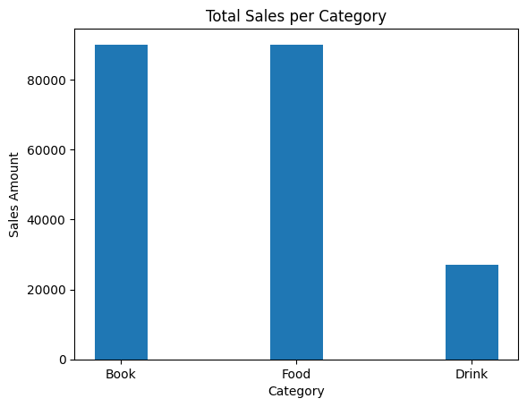
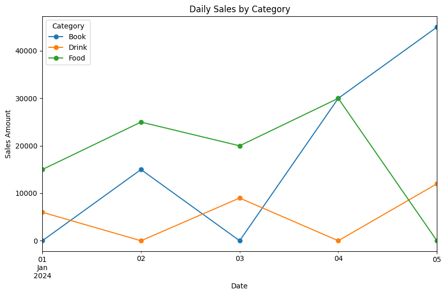

# Daily Sales Trend Analysis

## Objective
- Analyze daily sales trends and purchasing patterns by category and region.

## Technologies Used
- pandas
- matplotlib
- datetime handling with pandas

## Analysis
- Total sales by date, region, and category
- Daily sales by category
- Daily sales trend analysis

## Visualization

## Conclusion
- Each region showed higher purchase quantities for specific categories, suggesting possible differences in regional category preferences. This pattern could be useful for region-specific marketing or sales strategies.
- Daily sales were relatively higher on 2024-01-04 and 2024-01-05, despite the same number of orders per day.
- Food had the highest average quantity purchased per order, suggesting that customers tended to purchase it in larger quantities per order.

## Notes
- The dataset was generated with the assistance of ChatGPT.