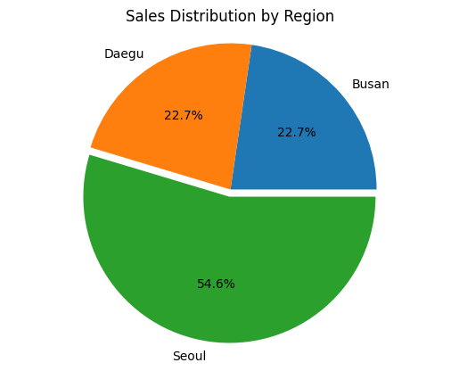
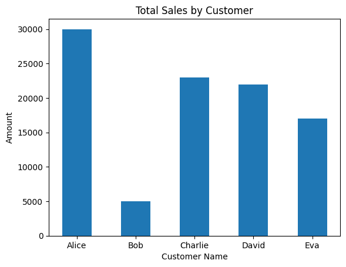
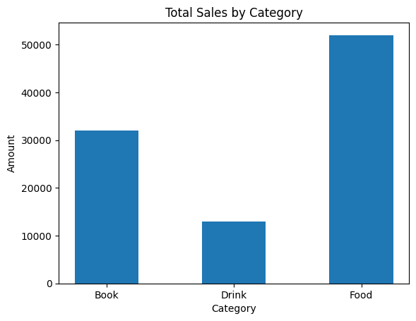

# Online Store Sales Analysis

## Objective
- Analyze customer purchase data to identify sales trends by region, category, and customer behavior.

## Technologies Used
- pandas
- matplotlib

## Analysis
- Total sales by customer, region, and category
- Average sales by customer and region
- Top customers by purchase amount

## Additional Metrics
- Average Order Value (AOV)
- Purchase count by customer

## Visualization

## Conclusion
- Alice recorded both the highest total spending and the highest number of purchases.
- Seoul recorded the highest total sales, accounting for 54.6% of overall sales.
- Food recorded the highest total sales among all categories.

## Notes
- The dataset was generated with the assistance of ChatGPT.