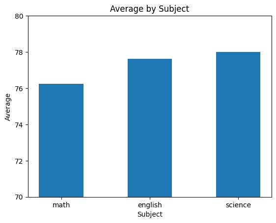
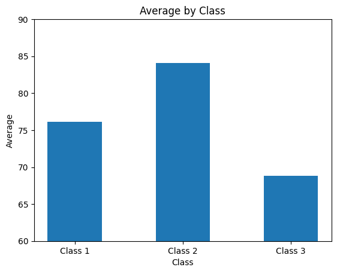

# Student Score Analysis with Pandas

## Objective
- Analyze student score data to examine average scores and class performance.

## Technologies Used
- pandas
- matplotlib

## Analysis
- Average score by student
- Top-performing students based on average score
- Average score by subject
- Average score by class

## Visualization

## Conclusion
- The science subject showed the highest average score, indicating relatively strong performance among students.
- Class 2 recorded the highest average score among the three classes.
- Student 'F' achieved the highest average score with 92.3 points.

## Notes
- The dataset was generated with the assistance of ChatGPT.
- The y-axis range of the graphs was narrowed to emphasize differences in the analysis.